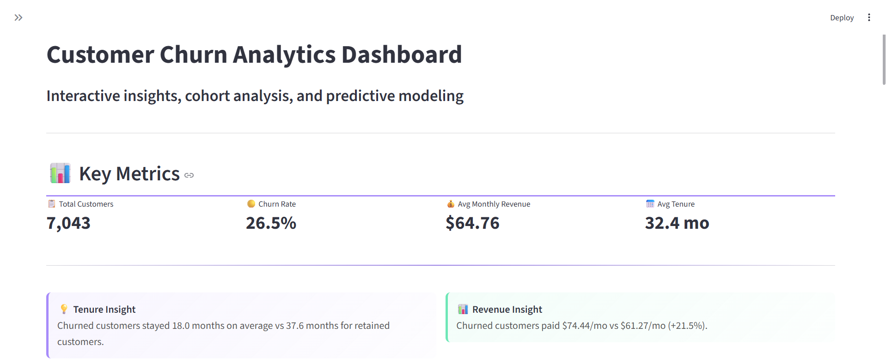

# 📊 Telco Customer Churn Prediction

A machine learning analysis to predict telecom customer churn and identify key drivers of customer retention.

**Goal:** Predict which telecom customers are most likely to leave using demographic and contract-related data.

## 🧠 Overview

This project explores the IBM Telco Customer Churn dataset.  
I built two models — Logistic Regression and XGBoost — to predict customer churn and identify the main drivers behind it.

## ⚙️ Workflow

1. **Data cleaning:** handled missing TotalCharges, encoded categorical features.  
2. **Modeling:** baseline Logistic Regression + tuned XGBoost with threshold optimization.  
3. **Evaluation:** compared accuracy, ROC-AUC, precision, recall across thresholds.  
4. **Interpretation:** visualized feature importances and extracted actionable business insights.

## 📈 Key Results

Both models achieved strong performance (ROC-AUC ≈ 0.85). Logistic Regression offered slightly better interpretability, while XGBoost achieved marginally higher recall after tuning.

| Model               | ROC-AUC | Best Threshold | Recall | Precision |
| ------------------- | ------- | -------------- | ------ | --------- |
| Logistic Regression | 0.84    | 0.3            | 0.75   | 0.52      |
| XGBoost (tuned)     | 0.85    | 0.3            | 0.79   | 0.54      |

## 🚀 Model Performance

Below are the ROC and Precision–Recall curves for both models, illustrating their classification performance.

## 🔑 Feature importance plots

<table>
<tr>
<td>

   **Logistic Regression Feature Importance**

</td>
<td>

   **XGBoost Feature Importance**

</td>
</tr>
</table>

## 🗣️ Insights

- Month-to-month contracts and higher bills strongly correlate with churn.  
- Long-term customers and DSL users show much higher retention.  
- Optimizing retention should focus on promoting longer contracts and lower-cost plans.

## 💻 Tech Stack

- Python (pandas, scikit-learn, matplotlib, seaborn, xgboost, shap)  
- Jupyter Notebook  
- Streamlit

## 📥 Data Source

The dataset used in this project is publicly available from IBM on [Kaggle: Telco Customer Churn Dataset](https://www.kaggle.com/datasets/blastchar/telco-customer-churn).

To reproduce the analysis:

1. Download the dataset file named  
   <pre>WA_Fn-UseC_-Telco-Customer-Churn.csv</pre>

2. Place it in this directory:  
   <pre>data/raw/WA_Fn-UseC_-Telco-Customer-Churn.csv</pre>

_Note:_ Raw data is not included in this repository to keep it lightweight and comply with dataset licensing.

## 🧩 How to Run

<pre>bash pip install -r requirements.txt 
jupyter notebook notebooks/01_churn_analysis.ipynb</pre>

## 💻 Interactive Streamlit App

Run the interactive dashboard (uses the same dataset path as above by default):

<pre>streamlit run app.py</pre>

Upload your own CSV in the sidebar **or** keep the default:  
<pre>data/raw/WA_Fn-UseC_-Telco-Customer-Churn.csv</pre>

Tabs include EDA, cohort views, on-the-fly Logistic Regression training, and scoring with CSV export.

