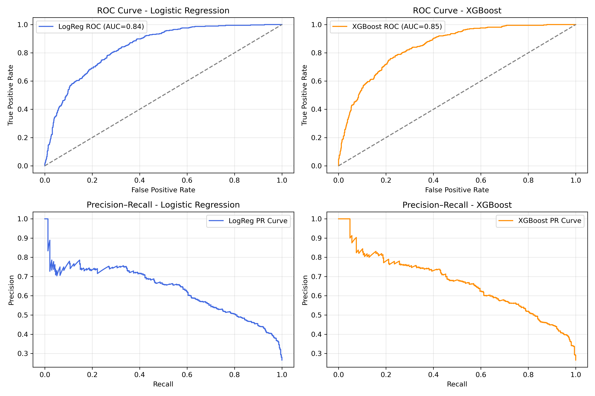
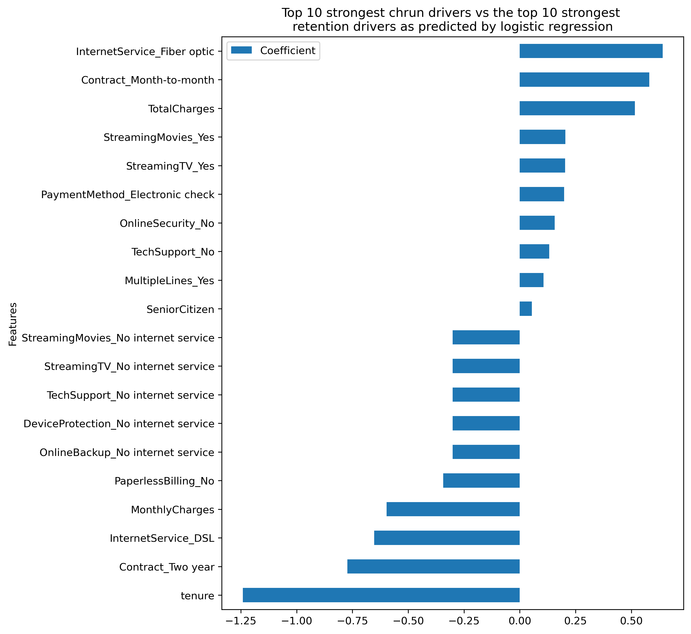
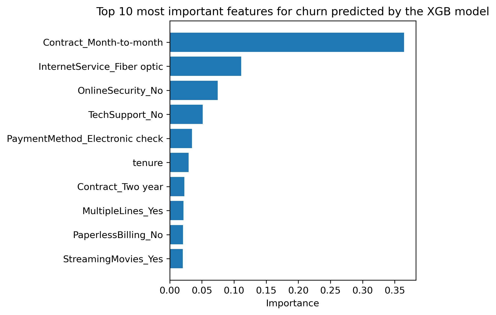

# Telco Customer Churn Analysis

A data analysis and machine learning project for understanding telecom customer churn, identifying the factors associated with customer attrition, and building classification models to identify customers who are at higher risk of leaving.

The project combines **Python, SQL, Pandas, Scikit-learn, XGBoost, Matplotlib, Seaborn, and Streamlit** to provide both analytical and predictive insights from the IBM Telco Customer Churn dataset.

## Project Overview

Customer churn is a major business problem for subscription-based businesses. Identifying customers who are likely to leave allows organizations to take proactive retention measures and better understand the factors influencing customer loyalty.

This project analyzes telecom customer data to:

* Explore customer demographics, services, contracts, tenure, and billing behavior.
* Identify patterns and factors associated with customer churn.
* Calculate churn rates across different customer segments.
* Use SQL to analyze customer cohorts and usage/service-plan behavior.
* Build classification models to identify customers at risk of churn.
* Compare Logistic Regression and XGBoost performance.
* Optimize the classification threshold with a focus on churn recall.
* Interpret model results using feature importance.
* Communicate analytical findings through visualizations.
* Provide an interactive Streamlit application for exploring the dataset and making predictions.

## Objectives

The primary objectives of this project are:

1. Perform exploratory data analysis on telecom customer data.
2. Understand the distribution of churn across demographic and service-related cohorts.
3. Analyze the relationship between tenure, contract type, billing behavior, and churn.
4. Use SQL to segment customers based on usage and service characteristics.
5. Calculate churn rates across different customer segments.
6. Build machine learning models for churn prediction.
7. Evaluate models using metrics appropriate for an imbalanced classification problem.
8. Identify the most influential factors associated with customer churn.
9. Translate analytical and machine learning results into actionable business insights.

## Dataset

The project uses the **IBM Telco Customer Churn dataset**, which contains information about telecom customers, including demographic characteristics, subscribed services, contract details, payment methods, tenure, billing information, and churn status.

The dataset is publicly available through Kaggle:

[Kaggle - Telco Customer Churn Dataset](https://www.kaggle.com/datasets/blastchar/telco-customer-churn)

The raw dataset is not included in this repository.

### Dataset File

The expected dataset file is:

```text
WA_Fn-UseC_-Telco-Customer-Churn.csv
```

Place the file at:

```text
data/raw/WA_Fn-UseC_-Telco-Customer-Churn.csv
```

## Analytical Workflow

The project follows a structured data-analysis and machine-learning workflow.

```text
Raw Dataset
     |
     v
Data Cleaning
     |
     v
Exploratory Data Analysis
     |
     +------------------+
     |                  |
     v                  v
Python Analysis       SQL Analysis
     |                  |
     |                  v
     |             Customer Cohorts
     |                  |
     |                  v
     |             Churn Rates
     |                  |
     +--------+---------+
              |
              v
       Feature Engineering
              |
              v
       Model Development
              |
       +------+------+
       |             |
       v             v
Logistic Regression XGBoost
       |             |
       +------+------+
              |
              v
       Model Evaluation
              |
              v
      Threshold Optimization
              |
              v
       Feature Interpretation
              |
              v
       Business Insights
```

## 1. Data Cleaning

The first stage prepares the raw dataset for analysis and machine learning.

Key preprocessing steps include:

* Handling missing values in `TotalCharges`.
* Converting numerical variables into appropriate data types.
* Encoding categorical variables.
* Preparing the target variable for binary classification.
* Validating the resulting dataset before model training.

Data preprocessing is performed using Python and Pandas.

## 2. Exploratory Data Analysis

Exploratory analysis is used to understand customer characteristics and discover patterns associated with churn.

The analysis focuses on variables such as:

* Customer tenure
* Contract type
* Monthly charges
* Total charges
* Payment method
* Internet service
* Demographic characteristics
* Subscribed services
* Customer account information

The analysis examines how churn varies across different customer segments and how customer characteristics relate to retention.

Visualizations are created using Matplotlib and Seaborn.

## 3. SQL Analysis

SQL is used to perform customer segmentation and cohort-level analysis.

The SQL analysis focuses on:

* Grouping customers by demographic characteristics.
* Segmenting customers based on service plans.
* Analyzing customers by contract type.
* Comparing churn across customer cohorts.
* Examining billing and usage-related patterns.
* Calculating churn rates for different customer segments.

A typical churn-rate calculation can be represented as:

```text
Churn Rate = Number of Churned Customers / Total Customers
```

SQL provides an additional analytical layer alongside the Python-based exploratory analysis and machine learning workflow.

## 4. Feature Engineering

The cleaned dataset is transformed into a format suitable for machine learning.

This includes:

* Encoding categorical variables.
* Preparing numerical variables.
* Selecting relevant predictive features.
* Separating input features from the target variable.
* Preparing the data for model training and evaluation.

The target variable represents whether a customer churned.

## 5. Machine Learning Models

Two classification models are evaluated in the project.

### Logistic Regression

Logistic Regression is used as an interpretable baseline classification model.

Its advantages for this project include:

* Simple and efficient training.
* Strong interpretability.
* Ability to understand the direction and relative importance of features.
* Useful baseline for comparing more complex models.

### XGBoost

XGBoost is used as a tree-based classification model capable of capturing nonlinear relationships between customer characteristics and churn.

The XGBoost model is tuned and evaluated alongside Logistic Regression.

## 6. Model Evaluation

The models are evaluated using multiple classification metrics rather than relying only on accuracy.

The evaluation includes:

* Accuracy
* Precision
* Recall
* ROC-AUC
* Precision-Recall analysis

Because identifying customers who are likely to churn is an important objective, recall is particularly relevant.

A model that identifies more potential churners can provide the business with a larger pool of customers for proactive retention campaigns.

## 7. Threshold Optimization

The default classification threshold is not always optimal for a churn prediction problem.

This project evaluates different classification thresholds and selects a threshold that provides a more suitable balance between precision and recall.

The current analysis found that a threshold of approximately `0.30` provides improved churn recall compared with the default threshold.

This reflects a business-oriented approach where missing a potentially churn-prone customer can be more costly than contacting an additional customer who ultimately stays.

## Model Results

The current analysis produced the following results:

| Model               | ROC-AUC | Best Threshold | Recall | Precision |
| ------------------- | ------: | -------------: | -----: | --------: |
| Logistic Regression |    0.84 |           0.30 |   0.75 |      0.52 |
| XGBoost             |    0.85 |           0.30 |   0.79 |      0.54 |

Both models demonstrate strong discriminatory performance, with ROC-AUC values around 0.85.

XGBoost achieves slightly higher recall and precision after threshold optimization, while Logistic Regression provides a simpler and more interpretable model.

## Model Performance Visualization

ROC and Precision-Recall curves are used to compare the classification performance of the models.



These curves provide a more complete view of model performance across different classification thresholds.

## Feature Importance

Feature importance analysis is used to understand which customer characteristics contribute most strongly to churn predictions.

### Logistic Regression



Logistic Regression provides an interpretable view of the strongest predictive features.

### XGBoost



XGBoost feature importance provides insight into which variables contribute most strongly to the model's predictions.

## Key Business Insights

The analysis highlights several important patterns in customer churn.

### Contract Type

Customers on month-to-month contracts demonstrate substantially higher churn than customers with longer-term contracts.

This suggests that customers without long-term contractual commitments may require additional retention attention.

### Billing Patterns

Higher customer bills are associated with increased churn.

Billing-related variables should therefore be considered when identifying high-risk customers and designing targeted retention strategies.

### Tenure

Longer-tenure customers demonstrate stronger retention compared with newer customers.

This indicates that customer lifecycle stage can be an important factor when prioritizing retention initiatives.

### Internet Service

The analysis also identifies differences in churn behavior across internet-service categories, with DSL customers showing comparatively stronger retention.

### Retention Strategy

Based on the analysis, potential retention strategies include:

* Encouraging customers to move from month-to-month contracts to longer-term plans.
* Identifying high-billing customers for targeted retention campaigns.
* Paying particular attention to customers with shorter tenure.
* Using churn probability to prioritize retention outreach.
* Designing customer-specific offers based on contract and service characteristics.

These recommendations are based on patterns identified in the dataset and should be validated against actual retention campaign performance before being implemented at scale.

## Interactive Streamlit Application

The project also includes a Streamlit application for interactively exploring the churn dataset and performing prediction-related analysis.

The application supports:

* Exploratory data analysis.
* Customer cohort analysis.
* Interactive visualizations.
* Logistic Regression training.
* Customer scoring.
* CSV export of prediction results.

Run the application using:

```bash
uv run streamlit run app.py
```

The application can use the default dataset path:

```text
data/raw/WA_Fn-UseC_-Telco-Customer-Churn.csv
```

or accept an uploaded CSV through the interface.


## Project Structure

The project follows a structure similar to:

```text
customer-churn-analysis/
│
├── data/
│   └── raw/
│       └── WA_Fn-UseC_-Telco-Customer-Churn.csv
│
├── notebooks/
│   └── 01_churn_analysis.ipynb
│
├── outputs/
│   └── figures/
│       ├── roc_pr_curves.png
│       ├── top_ten_lr.png
│       └── top_ten_XGB.png
│
├── app.py
├── pyproject.toml
├── uv.lock
└── README.md
```

The exact contents may vary depending on the current project configuration.

## Installation

This project uses [`uv`](https://docs.astral.sh/uv/) for Python environment and dependency management.

### Prerequisites

Make sure Python and `uv` are installed on your system.

Verify the installation:

```bash
python --version
uv --version
```

### Clone the Repository

```bash
git clone https://github.com/kunaldxt/customer-churn-analysis.git
cd customer-churn-analysis
```

### Install Dependencies

If the repository contains a `uv.lock` file, synchronize the environment using:

```bash
uv sync
```

This creates or updates the project's virtual environment and installs the dependencies defined by the project.

If development dependencies are included and need to be installed:

```bash
uv sync --dev
```

## Dataset Setup

Download the IBM Telco Customer Churn dataset from Kaggle:

```text
https://www.kaggle.com/datasets/blastchar/telco-customer-churn
```

Place the downloaded CSV file in:

```text
data/raw/WA_Fn-UseC_-Telco-Customer-Churn.csv
```

The expected path is therefore:

```text
customer-churn-analysis/
└── data/
    └── raw/
        └── WA_Fn-UseC_-Telco-Customer-Churn.csv
```

The raw dataset is intentionally excluded from the repository.

## Running the Jupyter Notebook

To launch Jupyter through the project's `uv` environment:

```bash
uv run jupyter notebook
```

Then open:

```text
notebooks/01_churn_analysis.ipynb
```

Alternatively:

```bash
uv run jupyter lab
```

## Running the Streamlit Application

Start the interactive application with:

```bash
uv run streamlit run app.py
```

After starting the application, Streamlit will provide a local URL that can be opened in a browser.

## Running Python Scripts

Python scripts can be executed through the managed environment using:

```bash
uv run python <script_name>.py
```

For example:

```bash
uv run python app.py
```

Use the command appropriate to the entry point defined by the project.

## Managing Dependencies with uv

To add a new runtime dependency:

```bash
uv add package-name
```

For example:

```bash
uv add pandas
```

To add a development dependency:

```bash
uv add --dev pytest
```

To remove a dependency:

```bash
uv remove package-name
```

To update project dependencies:

```bash
uv lock
```

To synchronize the environment with the lockfile:

```bash
uv sync
```

Using `uv.lock` ensures that the project environment can be reproduced consistently across machines.

## Reproducibility

For a clean setup:

```bash
git clone https://github.com/kunaldxt/customer-churn-analysis.git
cd customer-churn-analysis
uv sync
```

Then place the dataset at:

```text
data/raw/WA_Fn-UseC_-Telco-Customer-Churn.csv
```

Run the analysis or application:

```bash
uv run jupyter notebook
```

or:

```bash
uv run streamlit run app.py
```


